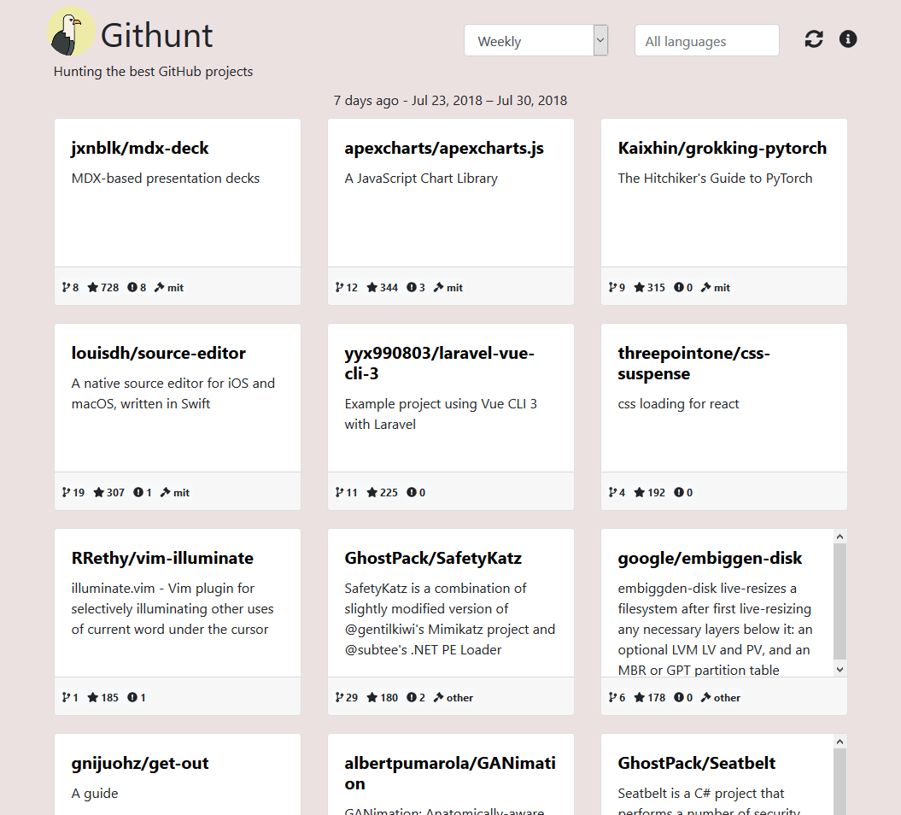
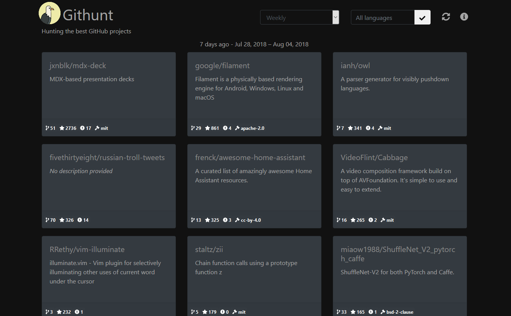

<h1 align="center">Githunt</h1>

    Greetings traveler! Let's go hunting. :boar:

## Light mode

## Dark mode

## install (dev)
`npm i`

## run (dev)
`npm start`

## test
`npm test`

## Deploy as an extension (prod)
`npm build`

Then submit or pack (as zip) the build folder

## Deploy on Github pages
`npm run deploy`

## Contributors
[@WaSa42 - https://github.com/WaSa42](https://github.com/WaSa42)
