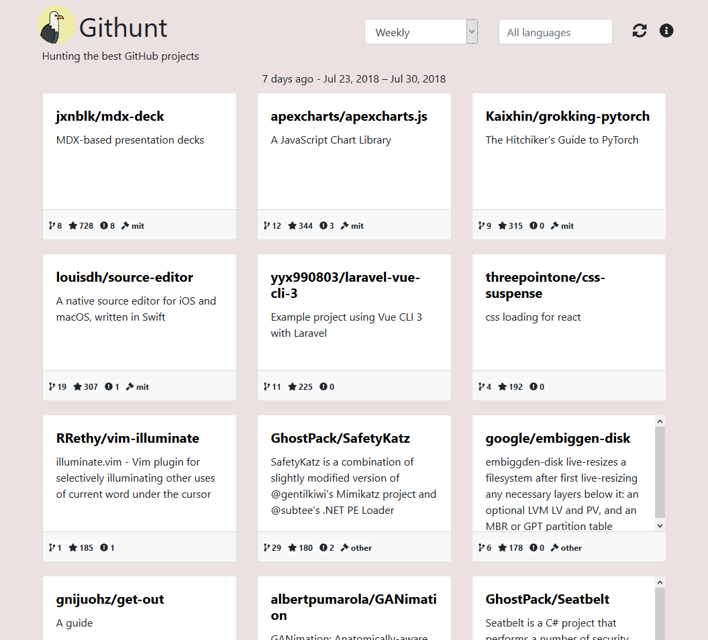
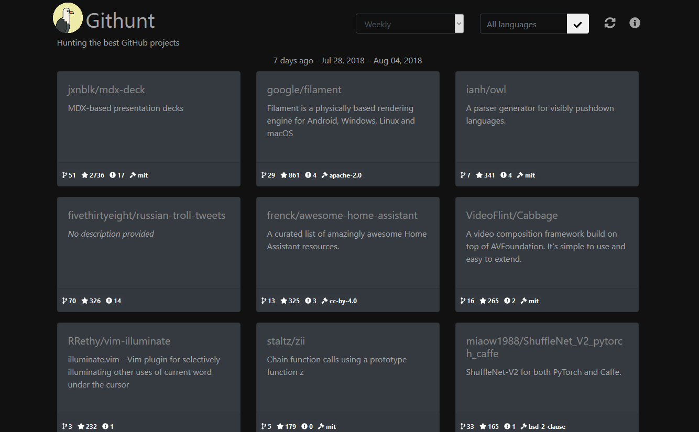

<h1 align="center">Githunt</h1>

    Greetings traveler! Let's go hunting. :boar:

## By day

## By night

## install (dev)

`npm i`

## run (dev)

`npm start`

## test

`npm test`

## Deploy as an extension (prod)

`npm run build`

Then submit or pack (as zip) the build folder.

Or use the package commands to build and zip in one step:

`npm run package` - creates `githunt-<version>.zip` (extension archive for store submission)

`npm run package:source` - creates `githunt-<version>-source.zip` (source archive for addon review)

`npm run package:all` - creates both archives at once

## Deploy on Github pages

`npm run deploy`

## Contributors

[@WaSa42 - https://github.com/WaSa42](https://github.com/WaSa42)
